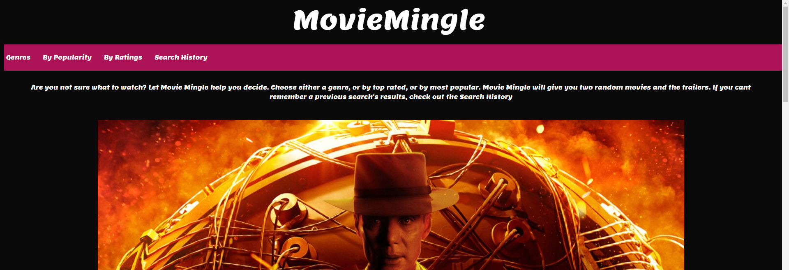
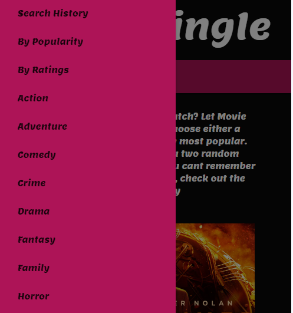
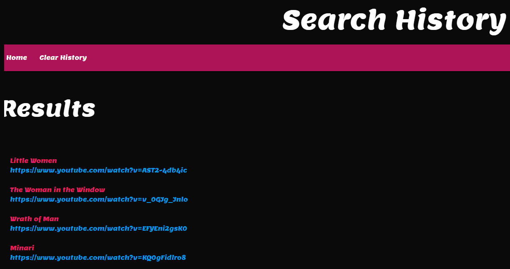

# MovieMingle-Project

## Description
Let people know what your project can do specifically. Provide context and add a link to any reference visitors might be unfamiliar with. A list of Features or a Background subsection can also be added here. If there are alternatives to your project, this is a good place to list differentiating factors.

## Badges
On some READMEs, you may see small images that convey metadata, such as whether or not all the tests are passing for the project. You can use Shields to add some to your README. Many services also have instructions for adding a badge.

## Visuals

   

## Installation and Usage
Upon visiting the *url here*, Movie Mingle has a nav bar with A genres pulldown menu, to select a specific movie genre, or by popularity, or by best rated. By choosing any of those options,  a pop up window will appear with two movie titles and a clickable link to youtube for the trailer of the coresponding movie. On smaller devices and mobile, the nav bar links disappear and the burger menu icon appears, when it is clicked the clickable items to get your movie reccomandations pop out from the left side of the screen. By clicking on the search history link, you are redirected to a page that keeps all the movies and their youtube links for the user to look back on their results. By clicking the clear history button, the page and its local history will be cleared.

## Contributing
We are open for outside contribution, as this is started in an educational setting, and there can always be improvments.

## Authors and acknowledgment
Movie Mingle written by:
Matheus Almeida,
Thomas Neylon,
James Ross.

## License
This project currently has no liscence.

## Project status
Under Development
